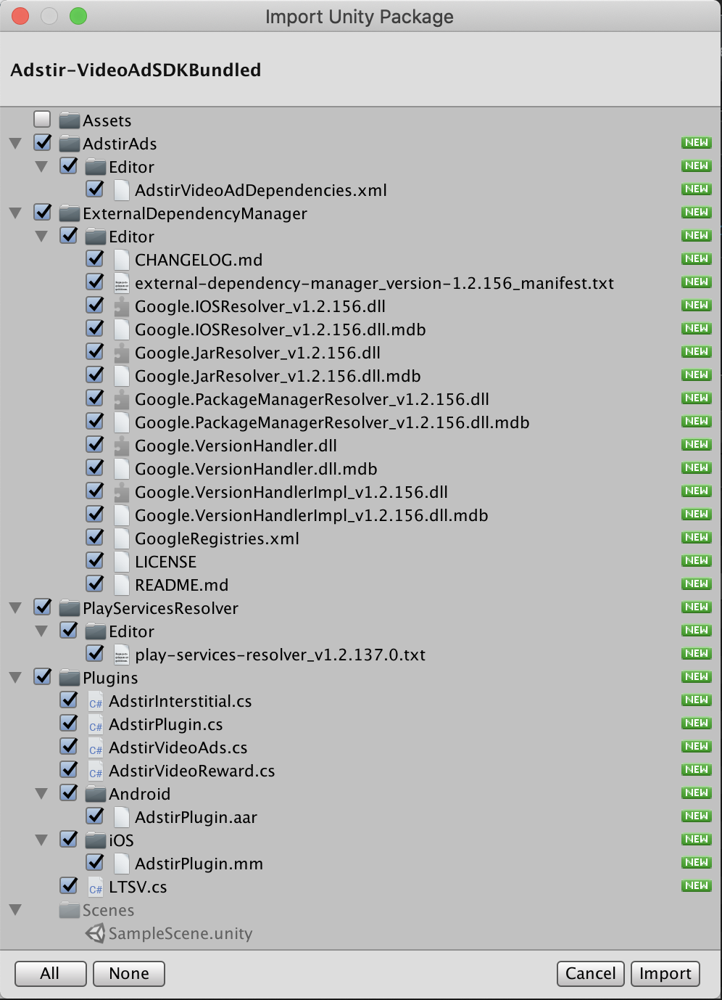

# 初期設定

!!! Warning "v2.15.0以前のUnityプラグインからアップデートされる皆様へ"
    v2.15.0からUnityプラグインのファイル構成が変わっております。以前のバージョンからアップデートされる場合は、[こちら](question.md#アップデートに当たって旧プラグインのファイル一覧を知りたい)を参考に旧プラグインに含まれるファイルを削除してください。

## Unityプラグインの入手
管理画面にログインして、対象の枠の「タグ/SDK」を選択してください。  
「SDKダウンロード」より「adstir SDK (Unityプラグイン)」をダウンロードしてください。  
動画リワード広告または全画面インタースティシャル広告をご利用の場合は、「動画SDK (Unityプラグイン)」をダウンロードしてください。

## Unityプラグインのインポート
組み込みたいプロジェクトを開き、[Assets] > [Import Package] > [Custom Package] より、Unityプラグインを選択します。  
すべてのファイルのチェックボックスがオンになっていることを確認して、[Import] をクリックします。

## SDKの追加
本プラグインには、[Play Services Resolver](https://github.com/googlesamples/unity-jar-resolver)が同梱されています。  
Play Services Resolverを使用して、iOS/AndroidのSDKをプロジェクトに追加します。  

### Android
[File] > [Build Settings...] から設定画面を開き、「Platform」を「Android」に設定します。

[Assets] > [External Dependency Manager] > [Android Resolver] > [Resolve] を選択し、SDKを追加します。

### iOS
iOSのSDKは、ビルド時に[CocoaPods](https://cocoapods.org/)によって追加されます。  
SDKを追加する特別な手順はありません。

#### info.plistの更新

iOS 14以降で[SKAdNetwork](https://developer.apple.com/documentation/storekit/skadnetwork)を利用するために、Info.plistにSKAdNetworkItemsを設定する必要があります。  
[こちら](https://united-adstir.github.io/ios-sdk-docs/adstir/init/ios14.html)から最新のSKAdNetworkItemsを取得し、`Assets/Adstir/Editor/info.plist`のSKAdNetworkItemsを更新してください。
